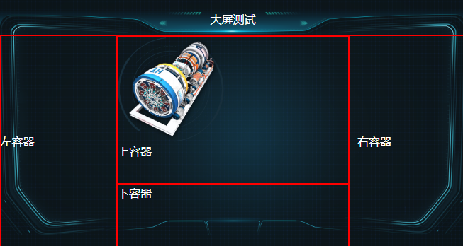
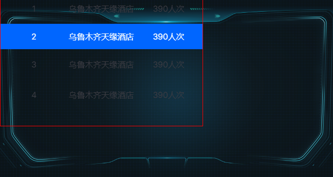

# Hamster Charts


> 基于 Vite 与 Vue3 开发的可视化组件库

[官方文档](http://hamster-charts.hejiu45.top) | [GitHub](https://gitee.com/hejiu45/hamster-charts) | [English](./README_EN.md)

## 介绍

Hamster Charts（仓鼠图表）是一个简约、简单、易上手的可视化组件库，由鹤酒（hejiu45）独立开发。该组件库基于 Vite 和 Vue3 构建，提供丰富的可视化图表和布局组件，适用于数据可视化大屏、监控系统仪表盘等场景。

### 特性

- 🚀 基于 Vite + Vue3 构建，开发体验流畅
- 📦 组件丰富，覆盖多种可视化场景
- 🎨 主题样式灵活可定制
- 📱 响应式设计，适配多种屏幕
- 🔌 插件化架构，易于扩展

## 效果展示

| 全组件使用展示 | 身体组件使用展示 |
| ------------------------------------------------------------ | ------------------------------------------------------------ |
| 头部标题组件使用展示 | 滚动数据列表组件使用展示 |

## 组件列表

| 组件 | 描述 |
|------|------|
| `h-body` | 页面主体容器 |
| `h-header` | 页面头部组件 |
| `h-content` | 内容区域组件 |
| `h-bottom` | 底部组件 |
| `h-left` / `h-right` / `h-center` | 左右中布局组件 |
| `h-top` | 顶部组件 |
| `h-chart` | 图表容器 |
| `h-chart-title` | 图表标题 |
| `h-item-chart` | 单项图表 |
| `h-counters` | 数字计数器 |
| `h-data-label` | 数据标签 |
| `h-button` | 按钮组件 |
| `h-button-group` | 按钮组 |
| `h-grid` | 网格布局 |
| `h-list` | 列表组件 |
| `h-diy` | 自定义组件 |

## 安装

### NPM

```sh
npm i hamster-charts
```

### PNPM

```sh
pnpm i hamster-charts
```

## 卸载

```sh
npm uninstall hamster-charts
```

## 快速开始

### 全局引用

```js
import { createApp } from 'vue'
import './style.css'
import App from './App.vue'

// 手动引用样式
import HamsterCharts from 'hamster-charts'
import 'hamster-charts/dist/hamster-charts.css'

createApp(App).use(HamsterCharts).mount('#app')
```

### 局部引用

```html
<script setup>
import bg01 from "./assets/bg.png"
import header from "./assets/header.png"
import bg02 from "./assets/bg01.png"
// 局部引入
import { hBody, hHeader, hContent } from "hamster-charts"
</script>

<template>
  <h-body :imgUrl="bg01">
    <h-header :imgUrl="header"></h-header>
    <h-content :imgUrl="bg02"></h-content>
  </h-body>
</template>
```

## 项目结构

```
hamster-charts/
├── packages/              # 组件源码
│   ├── body/             # 主体容器
│   ├── header/           # 头部组件
│   ├── content/          # 内容区域
│   ├── chart/            # 图表组件
│   ├── counters/         # 数字计数器
│   ├── dataLabel/        # 数据标签
│   ├── grid/             # 网格布局
│   ├── list/             # 列表组件
│   └── ...               # 其他组件
├── public/               # 静态资源
├── src/                  # 示例代码
└── vite.config.js        # Vite 配置
```

## 开发指南

```sh
# 克隆项目
git clone https://gitee.com/hejiu45/hamster-charts.git

# 安装依赖
npm install
# 或
pnpm install

# 启动开发服务器
npm run dev

# 构建生产版本
npm run build
```

## 浏览器支持

支持现代浏览器（Chrome、Firefox、Safari、Edge）和 Vue3 支持的浏览器。

## 扩展插件

**插件名称**: dgpx-to-viewport

**网址**：http://hamster-charts.hejiu45.top

**插件介绍**:

## PostCSS dgpx 自适应单位插件详细说明

### 1. 插件功能

将自定义单位 `dgpx` 转换为 `vw`（视口宽度单位）或 `vh`（视口高度单位），实现大屏（如 1920x1080）的响应式布局。

---

### 2. 换算公式

#### 2.1 基础公式

- **`dgpx` → `px`**
  $$ 1dgpx = \text{dgpxRatio} \times px $$
  - 默认：`dgpxRatio = 2`，即 `1dgpx = 2px`。
- **`px` → `vw`（宽度相关属性）**
  $$ vw = \left( \frac{\text{pxValue}}{\text{designWidth}} \right) \times 100 $$
  - `designWidth`：设计稿宽度（默认 `1920px`）。
- **`px` → `vh`（高度相关属性）**
  $$ vh = \left( \frac{\text{pxValue}}{\text{designHeight}} \right) \times 100 $$
  - `designHeight`：设计稿高度（默认 `1080px`）。

---

#### 2.2 完整公式

- **宽度相关属性（如 `width`、`font-size`）**
  $$ vw = \left( \frac{\text{dgpxValue} \times \text{dgpxRatio}}{\text{designWidth}} \right) \times 100 $$
- **高度相关属性（如 `height`、`top`）**
  $$ vh = \left( \frac{\text{dgpxValue} \times \text{dgpxRatio}}{\text{designHeight}} \right) \times 100 $$

---

#### 2.3 示例计算

| dgpx值 | 转换为 px | 转换为 vw (designWidth=1920) | 转换为 vh (designHeight=1080) |
| ------ | --------- | ---------------------------- | ----------------------------- |
| 50dgpx | 100px     | 100/1920×100=5.2083*v**w*    | 100/1080×100=9.2593*v**h*     |
| 16dgpx | 32px      | 32/1920×100=1.6667*v**w*     | 32/1080×100=2.9630*v**h*      |

---

### 3. 插件安装

#### 3.1 通过 npm 安装

```sh
pnpm add vite-plugin-dgpx-viewport
```

#### 3.2 在 Vite 项目中配置

```js
// vite.config.js
import { defineConfig } from 'vite';
import vue from '@vitejs/plugin-vue';
import { createDgpxViewportPlugin } from 'vite-plugin-dgpx-viewport';

export default defineConfig({
  plugins: [
    vue(),
    createDgpxViewportPlugin({
      designWidth: 1920,    // 设计稿宽度
      designHeight: 1080,   // 设计稿高度
      dgpxRatio: 2,         // 1dgpx = 2px
      unitPrecision: 4,     // 保留4位小数
      widthProps: ['font-size', 'width', 'left', 'right'], // 使用 vw 的属性
      heightProps: ['height', 'top', 'bottom']             // 使用 vh 的属性
    })
  ]
});
```

---

### 4. 使用示例

#### 4.1 在 Vue 组件中编写 CSS

```html
<template>
  <div class="container">
    <h1 class="title">大屏标题</h1>
    <div class="content"></div>
  </div>
</template>

<style scoped>
.title {
  font-size: 16dgpx;  /* 转换为 1.6667vw */
  margin: 8dgpx;      /* 转换为 0.8333vw */
}

.content {
  width: 960dgpx;     /* 转换为 100vw */
  height: 540dgpx;    /* 转换为 100vh */
  padding-top: 16dgpx;/* 转换为 1.4815vh */
}
</style>
```

#### 4.2 转换后的 CSS

```css
.title {
  font-size: 1.6667vw;
  margin: 0.8333vw;
}

.content {
  width: 100vw;
  height: 100vh;
  padding-top: 1.4815vh;
}
```

---

### 5. 配置参数说明

| 参数名          | 类型     | 默认值                                                       | 说明                                                  |
| --------------- | -------- | ------------------------------------------------------------ | ----------------------------------------------------- |
| `designWidth`   | number   | 1920                                                         | 设计稿宽度（单位：px），用于 `vw` 转换。              |
| `designHeight`  | number   | 1080                                                         | 设计稿高度（单位：px），用于 `vh` 转换。              |
| `dgpxRatio`     | number   | 2                                                            | `dgpx` 到 `px` 的转换比例（1dgpx = dgpxRatio * px）。 |
| `unitPrecision` | number   | 4                                                            | 转换后的 `vw`/`vh` 值保留的小数位数。                 |
| `widthProps`    | string[] | `['font-size', 'width', 'left', 'right', 'margin', 'padding']` | 使用 `vw` 单位的 CSS 属性列表。                       |
| `heightProps`   | string[] | `['height', 'top', 'bottom']`                                | 使用 `vh` 单位的 CSS 属性列表。                       |

---

### 6. 高级用法

#### 6.1 动态设计稿尺寸（构建时）

通过环境变量动态设置设计稿尺寸：

```js
// vite.config.js
import { loadEnv } from 'vite';

export default defineConfig(({ mode }) => {
  const env = loadEnv(mode, process.cwd());
  return {
    plugins: [
      createDgpxViewportPlugin({
        designWidth: parseInt(env.VITE_DESIGN_WIDTH) || 1920,
        designHeight: parseInt(env.VITE_DESIGN_HEIGHT) || 1080,
      })
    ]
  };
});
```

#### 6.2 运行时动态调整（结合 VueUse）

在 Vue 组件中实时响应屏幕变化：

```html
<script setup>
import { useWindowSize } from '@vueuse/core';
import { computed } from 'vue';

const { width: screenWidth, height: screenHeight } = useWindowSize();

// 动态计算 dgpx 转换比例
const dgpxToVw = (value) => ((value * 2) / screenWidth.value) * 100;
const dgpxToVh = (value) => ((value * 2) / screenHeight.value) * 100;

const elementStyle = computed(() => ({
  width: `${dgpxToVw(960)}vw`, // 960dgpx → 100vw
  height: `${dgpxToVh(540)}vh` // 540dgpx → 100vh
}));
</script>

<template>
  <div class="dynamic-box" :style="elementStyle"></div>
</template>
```

---

### 7. 注意事项

1. **属性分类**：确保 `widthProps` 和 `heightProps` 包含所有需要转换的属性。

2. **极端屏幕适配**：使用媒体查询为小屏幕设置最小值：

   ```css
   .title {
     font-size: 16dgpx;
   }
   
   @media (max-width: 768px) {
     .title {
       font-size: 24px; /* 小屏幕固定值兜底 */
     }
   }
   ```

3. **单位冲突**：避免与其他 CSS 单位（如 `rem`）混用，可能导致计算混乱。

---

### 8. 插件源码与扩展

- **GitHub 仓库**：[vite-plugin-dgpx-viewport](https://github.com/your-repo/vite-plugin-dgpx-viewport)

- 扩展功能建议

  ：

  - 支持 `dgrpx`（基于高度的自定义单位）。
  - 添加 CSS 变量模式（如 `--dgpx-ratio`）。

---

通过以上配置和公式，你可以轻松实现大屏场景下的自适应布局！

## 贡献指南

欢迎提交 Issue 和 Pull Request！

## 许可证

AGPL-3.0 License

## 关于我们

### 鹤酒开源

大家好，我是鹤酒，来自"鹤酒开源"团队。我们是一群热爱技术的极客，专注于探索从前端到后端的各种开发技术和最佳实践。

作为独立开发者，我对技术的痴迷已经达到了废寝忘食的地步。无论是深入研究算法优化，还是探讨最新的 Web 框架，或是解决复杂的系统架构问题，我都乐此不疲。

在"鹤酒开源"这个团队里，我们秉持开放共享的理念，致力于通过开源项目贡献自己的力量，并积极参加各种技术社区活动。

---

Made with ❤️ by [鹤酒开源](http://hamster-charts.hejiu45.top/src/team/#鹤酒开源)